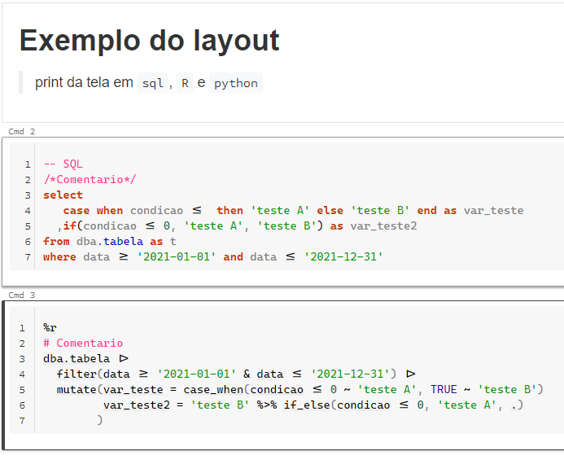
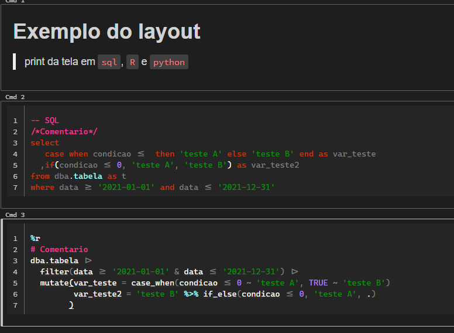

# Tema Databrikcs
Arquivo `.css` com minhas configurações da extenção `Databricks Power Tools`

[Link da extenção](https://chrome.google.com/webstore/detail/databricks-power-tools/mpffpmajkdieodggkakklfkghdiafhpo)

## Light
[

## Dark
[
